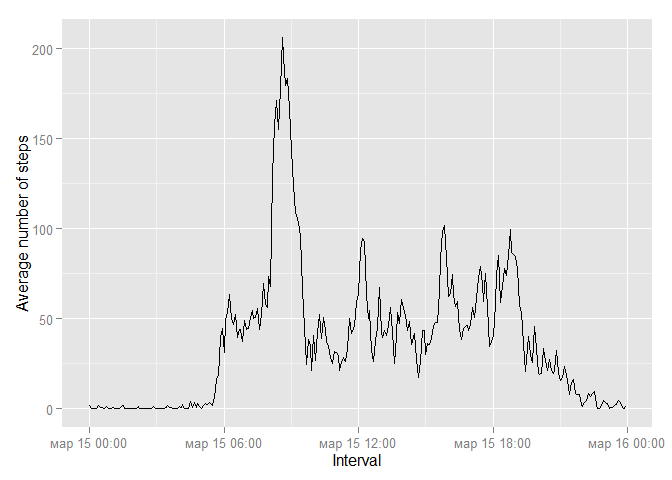

# Reproducible Research: Peer Assessment 1


## Loading and preprocessing the data

```r
doc <- read.csv(unzip("activity.zip"), colClasses = c("integer","character","character"))
```
## What is mean total number of steps taken per day?

```r
total_steps_per_day <- tapply(X = doc$steps, INDEX = doc$date, FUN = sum) 
```


```r
library(ggplot2)
qplot(x = total_steps_per_day, binwidth = 500, xlab = "Total steps per day")
```

 


```r
steps_mean <- as.character(mean(total_steps_per_day, na.rm = TRUE))
steps_median <- median(total_steps_per_day, na.rm = TRUE)
```

Mean of steps is 10766.1886792453 and median of steps is 10765.

## What is the average daily activity pattern?

```r
for(i in 1:length(doc$interval)){
    if(nchar(doc$interval[i])==1) {doc$interval[i]<-paste0("000",doc$interval[i])}
    if(nchar(doc$interval[i])==2) {doc$interval[i]<-paste0("00",doc$interval[i])}
    if(nchar(doc$interval[i])==3) {doc$interval[i]<-paste0("0",doc$interval[i])}
}
doc$interval <- as.POSIXct(doc$interval,format = "%H%M")
intervals <- unique(doc$interval)
average_steps <- tapply(doc$steps, as.factor(as.character(doc$interval)), mean, na.rm=TRUE)
qplot(x = intervals, y = average_steps, geom = "line", xlab = "Interval", ylab = "Average number of steps") 
```

 


```r
mean_all_periods <- tapply(doc$steps, as.factor(as.character(doc$interval)), mean, na.rm=TRUE)
max_mean_of_steps <- max(mean_all_periods)
period_of_max <- as.character(unique(doc$interval)[which.max(mean_all_periods)])
```

Maximum average is 206.1698113 during 2015-03-15 08:35:00 interval.

## Imputing missing values

```r
na_rows <- sum(is.na(doc$steps))
```

There are 2304 missed values.


```r
doc_fix <- doc
doc_fix$steps[is.na(doc_fix$steps)] <- mean_all_periods[which(is.na(doc_fix$steps))]
```


```r
total_steps_per_day_fix <- tapply(X = doc$steps, INDEX = doc$date, FUN = sum) 
```


```r
qplot(x = total_steps_per_day_fix, binwidth = 500, xlab = "Total steps per day")
```

 


```r
steps_mean_fix <- mean(total_steps_per_day_fix)
steps_median_fix <- median(total_steps_per_day_fix)
```
## Are there differences in activity patterns between weekdays and weekends?

```r
if_else_weekend <- function(date){
    isweekend <- ifelse(weekdays(as.Date(date))=="Saturday"|weekdays(as.Date(date))=="Sunday",
                        yes = "weekend", 
                        no = "weekday")
    return(as.factor(isweekend))
}
doc_fix <- cbind(doc_fix, if_else_weekend(doc_fix$date))
names(doc_fix)[4] <- "isweekend"
```


```r
intervals_fix <- unique(as.factor(as.character(doc_fix$interval))) 
average_steps_fix <- tapply(doc_fix$steps, as.factor(as.character(doc_fix$interval)), mean)
isweekend <- doc_fix$isweekend
qplot(x = intervals_fix, y = average_steps, geom = "line", xlab = "Interval", ylab = "Average number of steps") 
```

```
## geom_path: Each group consist of only one observation. Do you need to adjust the group aesthetic?
```

 
