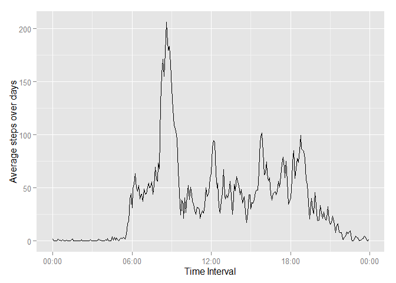

# Reproducible Research: Peer Assessment 1


## Loading and preprocessing the data

```r
doc <- read.csv(unzip("activity.zip"))
```

Change settings of loclization (personal issue).
Load nexessary libraries.
Unify form of interval quantity.
Make some transformations of quantities that hold date info.


```r
Sys.setlocale("LC_TIME","English")
```

```
## [1] "English_United States.1252"
```

```r
library(dplyr, warn.conflicts = FALSE)
library(ggplot2, warn.conflicts = FALSE)
library(scales, warn.conflicts = FALSE)
for(i in 1:length(doc$interval)){
    if(nchar(doc$interval[i])==1) {doc$interval[i]<-paste0("000",doc$interval[i])}
    if(nchar(doc$interval[i])==2) {doc$interval[i]<-paste0("00",doc$interval[i])}
    if(nchar(doc$interval[i])==3) {doc$interval[i]<-paste0("0",doc$interval[i])}
}
work_data <- doc
work_data <- mutate(.data = work_data, 
                    date = as.POSIXct(paste0(doc$date, doc$interval), 
                                      format = "%Y-%m-%d%H%M"))
work_data$date <- as.POSIXlt(work_data$date)
work_data <- select(.data = work_data, steps, date)
```
## What is mean total number of steps taken per day?

Make sure that we split data only according to days.
Actualy do it and sum over each group (day).


```r
days <- as.factor(as.character(trunc(work_data$date, "days")))
total_steps_per_day <- tapply(X = work_data$steps, 
                              INDEX = days, 
                              FUN = sum,
                              na.rm = TRUE) 
```


```r
qplot(x = total_steps_per_day, binwidth = 500, xlab = "Total steps per day")
```

 

Calculate mean and median value of quantity mentioned above. 
Change format to character to have it readable on print. 


```r
steps_mean <- as.character(mean(total_steps_per_day))
steps_median <- as.character(median(total_steps_per_day))
```

Mean of steps is 9354.22950819672 and median of steps is 10395.

## What is the average daily activity pattern?

Split data due to minutes and hours (disregard days, etc.).
Calculate mean over each group.
Drop dimensions of obtained matrix (vector now, which we can pass as an argument).
Extract time intervals over which we make calculations in few previous steps. 
Make a plot (take care of appropriate x-axis scaling).


```r
average_over_days_matrix <- tapply(X = work_data$steps,
                            INDEX = list(as.factor(work_data$date$min),
                                         as.factor(work_data$date$hour)
                                         ),
                            FUN = mean,
                            na.rm = TRUE)
average_over_days <- average_over_days_matrix
dim(average_over_days) <- NULL
intervals <- as.POSIXct(paste0(work_data$date$hour,"-", work_data$date$min),
                        format = "%H-%M")
intervals <- unique(intervals)
qplot(x = intervals, 
      y = average_over_days, 
      geom = "line", xlab = "Time Interval", ylab = "Average steps over days")+
      scale_x_datetime(labels = date_format("%H:00"))
```

 

Find index of maximum of the mean over all days of steps. 
Use this index to find correspondibg time interval.
Show only meaningful information (hours, minutes) disregard defaults (year, etc.)


```r
pre_position <- as.POSIXlt(intervals[which.max(average_over_days)])
max_steps <- paste0(pre_position$hour,":",pre_position$min)
```

Maximum number of steps observed across interval 8:35.

## Imputing missing values

```r
na_rows <- sum(is.na(doc$steps))
```

There are 2304 missed values.

Fix it using mean values of corresponding 5-min intervals.
The best way to understand way of replacement is actually to have a glimpse at 
average_over_days_matrix (socalled "rownames" and "colnames")


```r
fix_data <- work_data
logical <- is.na(work_data$steps)
for(i in 1:length(fix_data$steps)){
    if(is.na(fix_data$steps[i]))
        {
            fix_data$steps[i] <- average_over_days_matrix[(fix_data$date[i]$min/5)+1,
                                                          fix_data$date[i]$hour+1]
        }
}
```

The same as for previous mean calculation but with fixed data.


```r
total_steps_per_day_fix <- tapply(X = fix_data$steps, 
                                  INDEX = days, 
                                  FUN = sum) 
```


```r
qplot(x = total_steps_per_day_fix, binwidth = 500, xlab = "Total steps per day")
```

 

Change format to character to have it readable on print. 


```r
steps_mean_fix <- as.character(mean(total_steps_per_day_fix))
steps_median_fix <- as.character(median(total_steps_per_day_fix))
```

Mean of steps is 10766.1886792453 and median of steps is 10766.1886792453.
Difference is obvious and reasonable. Na's used to be counted as zeros, now they counted as respective mean values over 5-min intervals (Thats why mean and median over day increased). 

## Are there differences in activity patterns between weekdays and weekends?

Determine which days of dataset are weekdays/weekends.


```r
if_else_weekend <- function(date){
    isweekend <- ifelse(weekdays(date)=="Saturday"|weekdays(date)=="Sunday",
                        yes = "weekend", 
                        no = "weekday")
    return (isweekend)
}
isweekend <- as.factor(sapply(X = as.Date(fix_data$date), FUN = if_else_weekend))
fix_data <- mutate(fix_data, weekend = isweekend)
```

Split data over group of weekdays/weekends, minutes and hours.
Calculate mean over each subgroup.
Separate groups of weekdays and weekends and drop dimensions of matrixes for each of them.
Make some temporary quantities just to make it possible to pass all necessary data into qplot function. Two graphics this time (based on weekdays/weekends groups). Type of time intervla scaling the same as previously.


```r
average_over_days_array <- tapply(X = fix_data$steps,
                                  INDEX = list(as.factor(fix_data$date$min),
                                               as.factor(fix_data$date$hour),
                                               fix_data$weekend),
                                  FUN = mean)
average_over_days_weekday <- average_over_days_array[,,1]
average_over_days_weekend <- average_over_days_array[,,2]
dim(average_over_days_weekday) <- NULL
dim(average_over_days_weekend) <- NULL
 
temp <- c(average_over_days_weekday, average_over_days_weekend)
temp_weekend <- factor(c(rep("weekday",each = 288), rep("weekend",each = 288)))
qplot(x = rep(intervals,2), 
      y = temp, 
      geom = "line", xlab = "Time Interval", 
      ylab = "Average steps over different parts of week", 
      facets = temp_weekend~.)+
      scale_x_datetime(labels = date_format("%H:00"))
```

 

Let see what we got. Peoples sleep longer on weekends, but have more movement during the day (as expected ). 
